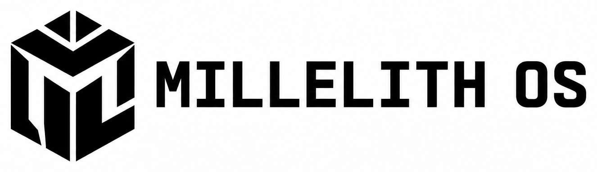

<p align="center">
  
</p>

# Millelith OS

<p align="center">
  <a href="#progress"></a>
  <a href="#what-i-want-to-learn"></a>
  <a href="#the-plan"></a>
  <a href="#the-plan"></a>
  <a href="#the-plan"></a>
  <a href="https://github.com/kenzietann/MillelithOS/stargazers"></a>
</p>

I'm building Millelith OS to learn how computers and operating systems work from the ground up. I want to understand what happens after code compiles: how firmware boots, how operating systems coordinate processes, and how software talks to hardware.

Rather than being confined to an emulator-only toy OS with no drivers, Millelith OS follows the proven architectural model of modern systems like Android and macOS:
1. **Firmware & Boot (100% Rust):** A custom, zero-dependency bare-metal UEFI bootloader written in Rust from scratch.
2. **The Hardware Engine:** The official Linux kernel (`vmlinuz`) driving physical PC hardware (Wi-Fi, 3D GPU, NVMe, USB 3.0, and multi-core CPU scheduling).
3. **The Operating System & Userspace (100% Rust):** A custom Unix userspace built in Rust, featuring a custom PID 1 Init system (`/sbin/init`), an interactive command-line shell with syntax parsing and job control, and memory-safe core utilities.

The earlier C++ UEFI proof-of-concept is preserved in the [`archive/cpp-uefi`](https://github.com/kenzietann/MillelithOS/tree/archive/cpp-uefi) branch.

For the detailed technical specifications and milestone roadmap, see [PRD.md](PRD.md).

---

## The Architecture

```
+-------------------------------------------------------------------------+
|                        Millelith OS Architecture                         |
+-------------------------------------------------------------------------+
| [Layer 3: Userspace & Apps (100% Custom Rust)]                          |
|  - Millelith Init (PID 1): Mounts /proc, /sys, /dev, manages services   |
|  - Millelith Shell: Interactive CLI, AST parser, job control, pipelines |
|  - Millelith Coreutils: Essential Unix utilities in memory-safe Rust    |
+-------------------------------------------------------------------------+
                                    │ POSIX Syscalls (fork, exec, pipe, ioctl)
+-----------------------------------v-------------------------------------+
| [Layer 2: The Hardware Engine (The Linux Kernel - vmlinuz)]             |
|  - Universal Hardware Support: Wi-Fi 6, 3D GPU (DRM/KMS), NVMe, USB 3.0 |
|  - Virtual Memory (Paging), Hardware Ring 0 Protection, CPU Scheduler  |
+-------------------------------------------------------------------------+
                                    │ Linux 64-bit Boot Protocol / EFI Handover
+-----------------------------------v-------------------------------------+
| [Layer 1: Custom Rust UEFI Bootloader (crates/bootloader)]              |
|  - Zero-dependency bare-metal PE32+ executable (x86_64-unknown-uefi)    |
|  - Probes Graphics Output Protocol (GOP) for high-res splash screen     |
|  - Locates and loads /boot/vmlinuz and /boot/initrd from FAT32/EXT4     |
|  - Sets up boot parameters and transfers control to the kernel          |
+-------------------------------------------------------------------------+
```

---

## What I Want to Learn

- **Firmware & Bare-Metal Systems:** 64-bit UEFI calling conventions (`extern "efiapi"`), PE/COFF execution, raw pointers, memory alignment, and GOP linear framebuffer rendering.
- **Operating System Core Concepts:** The POSIX system call interface (`fork`, `execve`, `mmap`, `pipe`, `ioctl`), signals (`SIGINT`, `SIGCHLD`), file descriptors, and virtual filesystems (`/proc`, `/sys`, `/dev`).
- **PID 1 & System Lifecycle:** Building an Init system from scratch to manage process trees, reap orphan processes, and handle system shutdown.
- **Compilers & Parsers:** Designing a custom shell with lexical analysis, AST parsing, and command execution pipelines.

---

## Progress

### 1. Proof of Concept (C++ UEFI)
- [x] Boot an x86-64 EFI application in QEMU.
- [x] Print text via UEFI firmware console services.
- [x] Acquire the Graphics Output Protocol (GOP) linear framebuffer.
- [x] Verify pixel formats and fill the screen with `#18416E` blue.
- [x] *Archived to branch [`archive/cpp-uefi`](https://github.com/kenzietann/MillelithOS/tree/archive/cpp-uefi).*

### 2. Phase 1: The Rust UEFI Bootloader (`crates/bootloader`)
- [x] Pure zero-dependency runtime implemented (`#![no_std]`, `#[panic_handler]`, `EfiStatus`).
- [x] Modular architecture (`src/uefi.rs` for protocol definitions, `src/main.rs` for boot logic).
- [x] Booted in QEMU with firmware text console output (`Hello from Millelith OS!`).
- [x] Implement `LocateProtocol` and query Graphics Output Protocol (GOP).
- [x] Verify linear framebuffer rendering: Fill screen with Millelith Red.
- [x] Implement FAT32 file reading protocol to load `vmlinuz` and `initrd` into physical RAM.
- [x] Implement Linux 64-bit EFI boot protocol handover (`ExitBootServices` and kernel jump).

### 3. Phase 2: Millelith Init (PID 1 in Rust)
- [x] Implement freestanding Rust PID 1 binary (`/sbin/init`).
- [x] Mount fundamental virtual filesystems: `/proc` (procfs), `/sys` (sysfs), `/dev` (devtmpfs).
- [ ] Configure standard I/O file descriptors (`stdin=0`, `stdout=1`, `stderr=2`).
- [ ] Implement POSIX signal handling (`SIGCHLD`, `SIGINT`, `SIGTERM`).
- [ ] Implement orphan process reaping (preventing zombie processes).
- [ ] Spawn the primary Millelith login / shell session.

### 4. Phase 3: Millelith Shell (Interactive Unix Shell in Rust)
- [ ] Interactive REPL with prompt rendering and line editing.
- [ ] Command string lexer and Abstract Syntax Tree (AST) parser.
- [ ] Process execution pipeline using `fork()` and `execve()`.
- [ ] Unix pipelines (`|`) using inter-process `pipe()` and `dup2()`.
- [ ] File redirection (`<`, `>`, `>>`).
- [ ] Built-in commands (`cd`, `exit`, `help`, `export`).

### 5. Phase 4: Millelith Core Utilities (Rust Coreutils)
- [ ] File manipulation: `ls`, `cat`, `cp`, `mv`, `rm`, `mkdir`.
- [ ] Process inspection: `ps` (parsing `/proc`), `kill`.
- [ ] System diagnostics: `uname`, `free`, `uptime`.

### 6. Phase 5: Distribution Packaging & Physical PC Deployment
- [ ] Construct standalone root filesystem (`rootfs`) image.
- [ ] Generate bootable GPT USB disk image (`millelith.img`) containing `/EFI/BOOT/BOOTX64.EFI`, `/boot/vmlinuz`, and `/boot/initrd`.
- [ ] Boot Millelith OS on physical PC bare metal: verify Wi-Fi connectivity, GPU display, and interactive shell.


---

## Artwork


- [Icon](assets/branding/millelith-os-icon.png)
- [Logo](assets/branding/millelith-os-logo.png)

---

## Toolchain & Requirements

### Host Dependencies
- **Rust (2024 Edition):** `rustup default nightly` (or stable 1.85+)
- **Rust Target:**
  ```sh
  rustup target add x86_64-unknown-uefi
  ```
- **QEMU:** `brew install qemu` (macOS) or `sudo apt install qemu-system-x86` (Linux)

---

## References

- [UEFI Specification 2.10](https://uefi.org/specifications)
- [The Linux/x86 Boot Protocol](https://docs.kernel.org/arch/x86/boot.html)
- [OSDev Wiki: UEFI](https://wiki.osdev.org/UEFI)
- [The Linux Programming Interface (Michael Kerrisk)](https://man7.org/tlpi/)
- [OSDev Wiki: APIC](https://wiki.osdev.org/APIC)